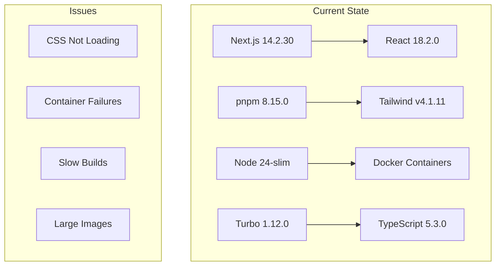
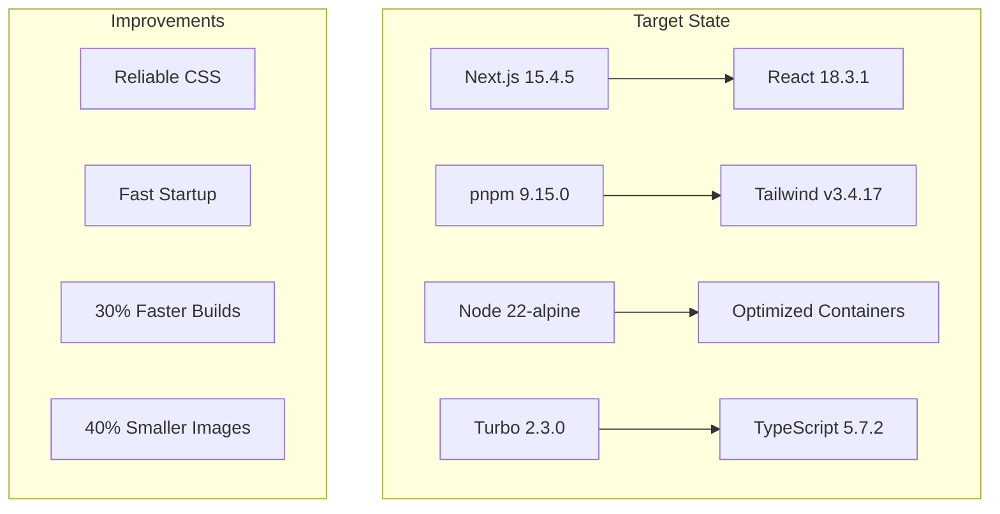
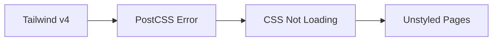
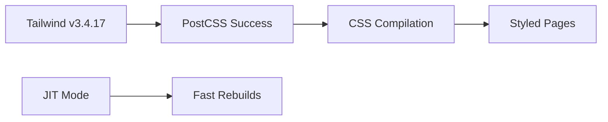
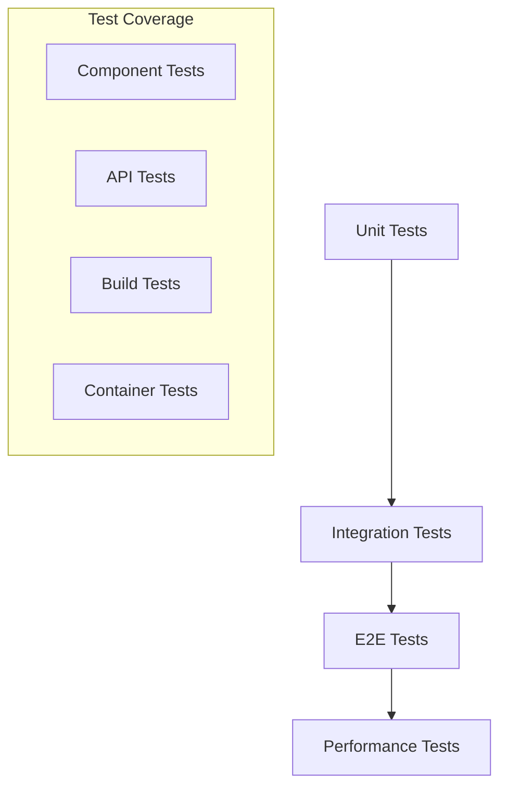

# Design Document

## Overview

This design document outlines the technical approach for upgrading the SaaS Startup Platform from Next.js 14.2.30 to Next.js 15.4.5, implementing Docker optimizations, and modernizing the entire development stack. The design follows a phased approach to minimize risk while maximizing performance and reliability improvements.

## Architecture

### Current Architecture Analysis



### Target Architecture



### Migration Strategy

The upgrade follows a **staged rollout approach** with four distinct phases:

1. **Foundation Phase**: Stabilize current issues and prepare environment
2. **Core Upgrade Phase**: Update Next.js and React with minimal configuration changes
3. **Optimization Phase**: Implement Docker improvements and performance enhancements
4. **Enhancement Phase**: Enable advanced features and final optimizations

## Components and Interfaces

### 1. Package Management System

#### Current State
```json
{
  "packageManager": "pnpm@8.15.0",
  "workspace": "packages/* apps/*",
  "issues": ["workspace conflicts", "slow installs", "version mismatches"]
}
```

#### Target Design
```json
{
  "packageManager": "pnpm@9.15.0",
  "workspace": {
    "packages": ["apps/*", "packages/*"],
    "catalog": true,
    "sharedWorkspace": true
  },
  "features": ["faster installs", "better caching", "conflict resolution"]
}
```

**Implementation Strategy:**
- Update global pnpm installation in Dockerfiles
- Migrate to pnpm catalog feature for version management
- Implement workspace-specific caching strategies
- Add dependency conflict resolution rules

### 2. Next.js Application Layer

#### Website App Architecture
```typescript
interface WebsiteConfig {
  nextjs: "15.4.5";
  features: {
    ppr: "incremental";           // Partial Prerendering
    turbo: boolean;               // Turbopack (when stable)
    reactCompiler: false;         // React Compiler (future)
    optimizedImages: true;        // Enhanced image optimization
    enhancedCaching: true;        // New caching strategies
  };
  output: "standalone";           // Docker-optimized output
  experimental: {
    serverComponentsExternalPackages: string[];
    optimizePackageImports: string[];
  };
}
```

#### CMS App Architecture
```typescript
interface CMSConfig extends WebsiteConfig {
  features: WebsiteConfig["features"] & {
    nextAuth: "5.0.0";           // Updated authentication
    tiptapEditor: "3.0.7";       // Rich text editor
    fileUpload: true;            // Enhanced file handling
  };
}
```

**Key Design Decisions:**
- **Standalone Output**: Optimizes for Docker deployment
- **Incremental PPR**: Enables partial prerendering for performance
- **Shared Configuration**: Common config between apps with app-specific overrides
- **Backward Compatibility**: Maintains existing API routes and pages

### 3. CSS Processing Pipeline

#### Current Problem


#### Target Solution


**CSS Architecture:**
```javascript
// postcss.config.js - Standardized across apps
module.exports = {
  plugins: {
    tailwindcss: {},
    autoprefixer: {},
    ...(process.env.NODE_ENV === 'production' && {
      cssnano: { preset: 'default' }
    })
  }
};

// tailwind.config.js - Optimized configuration
module.exports = {
  content: [
    './app/**/*.{js,ts,jsx,tsx,mdx}',
    './components/**/*.{js,ts,jsx,tsx,mdx}',
    '../../packages/ui/src/**/*.{js,ts,jsx,tsx,mdx}',
  ],
  theme: {
    extend: {
      // Design system tokens
    }
  },
  plugins: [
    require('@tailwindcss/forms'),
    require('@tailwindcss/typography')
  ]
};
```

### 4. Docker Container Architecture

#### Multi-Stage Build Design

```dockerfile
# Stage 1: Base - Common dependencies
FROM node:22-alpine AS base
RUN apk add --no-cache libc6-compat
RUN corepack enable && corepack prepare pnpm@9.15.0 --activate
WORKDIR /app

# Stage 2: Dependencies - Install packages
FROM base AS deps
COPY package.json pnpm-lock.yaml pnpm-workspace.yaml ./
COPY apps/*/package.json ./apps/*/
COPY packages/*/package.json ./packages/*/
RUN --mount=type=cache,id=pnpm,target=/root/.local/share/pnpm/store \
    pnpm install --frozen-lockfile

# Stage 3: Builder - Build application
FROM base AS builder
COPY --from=deps /app/node_modules ./node_modules
COPY . .
RUN pnpm build --filter=website

# Stage 4: Runner - Production runtime
FROM base AS runner
RUN addgroup --system --gid 1001 nodejs
RUN adduser --system --uid 1001 nextjs
COPY --from=builder --chown=nextjs:nodejs /app/apps/website/.next/standalone ./
COPY --from=builder --chown=nextjs:nodejs /app/apps/website/.next/static ./apps/website/.next/static
COPY --from=builder --chown=nextjs:nodejs /app/apps/website/public ./apps/website/public
USER nextjs
EXPOSE 3000
ENV PORT=3000 HOSTNAME="0.0.0.0"
CMD ["node", "apps/website/server.js"]
```

**Container Optimization Features:**
- **Layer Caching**: Separate dependency and build layers
- **Multi-stage**: Minimal production images
- **Security**: Non-root user execution
- **Performance**: BuildKit cache mounts
- **Size**: Alpine base images

### 5. Build System Architecture

#### Turbo Configuration
```json
{
  "$schema": "https://turbo.build/schema.json",
  "globalDependencies": ["**/.env.*local"],
  "pipeline": {
    "build": {
      "dependsOn": ["^build"],
      "outputs": [".next/**", "!.next/cache/**", "dist/**"],
      "env": ["NODE_ENV", "NEXT_PUBLIC_*"]
    },
    "dev": {
      "cache": false,
      "persistent": true,
      "env": ["NODE_ENV", "NEXT_PUBLIC_*"]
    },
    "lint": {
      "dependsOn": ["^build"],
      "outputs": []
    },
    "type-check": {
      "dependsOn": ["^build"],
      "outputs": []
    }
  },
  "remoteCache": {
    "enabled": true
  }
}
```

**Build Optimizations:**
- **Parallel Execution**: Multiple apps build concurrently
- **Incremental Builds**: Only rebuild changed packages
- **Remote Caching**: Share build cache across environments
- **Dependency Tracking**: Smart rebuild decisions

## Data Models

### Package Configuration Model
```typescript
interface PackageConfig {
  name: string;
  version: string;
  dependencies: Record<string, string>;
  devDependencies: Record<string, string>;
  peerDependencies?: Record<string, string>;
  scripts: Record<string, string>;
  engines: {
    node: string;
    pnpm: string;
  };
}

interface WorkspaceConfig {
  packages: string[];
  catalog?: Record<string, string>;
  sharedWorkspace?: boolean;
}
```

### Docker Configuration Model
```typescript
interface DockerConfig {
  baseImage: string;
  stages: {
    base: StageConfig;
    deps: StageConfig;
    builder: StageConfig;
    runner: StageConfig;
  };
  optimizations: {
    layerCaching: boolean;
    multiStage: boolean;
    securityHardening: boolean;
    sizeOptimization: boolean;
  };
}

interface StageConfig {
  from: string;
  workdir: string;
  user?: string;
  env?: Record<string, string>;
  expose?: number[];
  cmd?: string[];
}
```

### Build Configuration Model
```typescript
interface BuildConfig {
  nextjs: {
    version: string;
    config: NextConfig;
    experimental: Record<string, any>;
  };
  typescript: {
    version: string;
    strict: boolean;
    paths: Record<string, string[]>;
  };
  css: {
    framework: "tailwindcss";
    version: string;
    processor: "postcss";
  };
}
```

## Error Handling

### Build Error Recovery
```typescript
interface BuildErrorHandler {
  onDependencyError: (error: DependencyError) => RecoveryAction;
  onCompilationError: (error: CompilationError) => RecoveryAction;
  onContainerError: (error: ContainerError) => RecoveryAction;
}

type RecoveryAction = 
  | { type: "retry"; maxAttempts: number }
  | { type: "fallback"; fallbackConfig: any }
  | { type: "rollback"; targetVersion: string }
  | { type: "abort"; reason: string };
```

**Error Handling Strategies:**
1. **Dependency Conflicts**: Automatic resolution with fallback versions
2. **Build Failures**: Incremental retry with detailed logging
3. **Container Issues**: Health checks with automatic restart
4. **CSS Compilation**: Fallback to previous working configuration

### Rollback Mechanism
```typescript
interface RollbackStrategy {
  triggers: {
    buildFailure: boolean;
    testFailure: boolean;
    performanceRegression: boolean;
    userReported: boolean;
  };
  actions: {
    dependencyRollback: () => Promise<void>;
    configRollback: () => Promise<void>;
    containerRollback: () => Promise<void>;
    fullRollback: () => Promise<void>;
  };
  validation: {
    healthChecks: HealthCheck[];
    performanceTests: PerformanceTest[];
    functionalTests: FunctionalTest[];
  };
}
```

## Testing Strategy

### Testing Pyramid


### Test Categories

#### 1. Unit Tests
- **Component Rendering**: Verify all React components render correctly
- **Utility Functions**: Test helper functions and utilities
- **Configuration Validation**: Ensure configs are valid
- **Type Safety**: TypeScript compilation tests

#### 2. Integration Tests
- **API Endpoints**: Test all backend integrations
- **Database Connections**: Verify CouchDB connectivity
- **Authentication Flow**: Test Next-Auth integration
- **File Upload**: Test media handling

#### 3. End-to-End Tests
- **User Journeys**: Critical path testing
- **Cross-browser**: Chrome, Firefox, Safari compatibility
- **Mobile Responsive**: Touch and mobile interactions
- **Performance**: Page load and interaction timing

#### 4. Container Tests
- **Build Success**: All containers build without errors
- **Startup Time**: Containers start within SLA
- **Health Checks**: All services respond correctly
- **Resource Usage**: Memory and CPU within limits

### Performance Benchmarks
```typescript
interface PerformanceBenchmarks {
  buildTime: {
    current: number;    // 5 minutes
    target: number;     // 2 minutes
    measurement: "seconds";
  };
  bundleSize: {
    current: number;    // Current size
    target: number;     // 15% reduction
    measurement: "MB";
  };
  pageLoad: {
    current: number;    // Current load time
    target: number;     // < 1 second
    measurement: "milliseconds";
  };
  hotReload: {
    current: number;    // Current reload time
    target: number;     // < 500ms
    measurement: "milliseconds";
  };
}
```

## Implementation Phases

### Phase 1: Foundation (2-3 hours)
**Objective**: Stabilize current issues and prepare for upgrade

**Tasks:**
1. Fix Tailwind CSS compilation issues
2. Resolve Docker container startup problems
3. Update package manager to pnpm 9.15.0
4. Create backup and rollback procedures

**Success Criteria:**
- All containers start successfully
- CSS loads correctly
- Development environment is stable

### Phase 2: Core Upgrade (1-2 hours)
**Objective**: Update Next.js and React to target versions

**Tasks:**
1. Update Next.js to 15.4.5
2. Update React to 18.3.1
3. Update TypeScript to 5.7.2
4. Resolve any breaking changes

**Success Criteria:**
- All builds complete successfully
- No TypeScript errors
- All existing functionality works

### Phase 3: Docker Optimization (2-3 hours)
**Objective**: Implement optimized Docker containers

**Tasks:**
1. Implement multi-stage Dockerfiles
2. Add layer caching optimizations
3. Reduce image sizes
4. Add security hardening

**Success Criteria:**
- Build time reduced by 30%
- Image size reduced by 40%
- Containers start reliably

### Phase 4: Enhancement (1-2 hours)
**Objective**: Enable advanced features and final optimizations

**Tasks:**
1. Enable Partial Prerendering
2. Optimize Turbo configuration
3. Add performance monitoring
4. Update documentation

**Success Criteria:**
- Performance improvements measurable
- All tests passing
- Documentation complete

## Risk Mitigation

### High-Risk Areas
1. **Breaking Changes**: Next.js 15 may introduce breaking changes
2. **Dependency Conflicts**: Package version mismatches
3. **Container Issues**: Docker build failures
4. **Performance Regressions**: Slower than current performance

### Mitigation Strategies
1. **Incremental Updates**: Update packages in small batches
2. **Comprehensive Testing**: Test after each phase
3. **Rollback Procedures**: Quick revert mechanisms
4. **Performance Monitoring**: Continuous benchmarking

### Contingency Plans
1. **Partial Rollback**: Revert specific components if needed
2. **Feature Flags**: Disable new features if issues arise
3. **Alternative Approaches**: Fallback configurations available
4. **Extended Timeline**: Additional time if complex issues found

This design provides a comprehensive roadmap for the Next.js 15.4.5 upgrade while maintaining system stability and improving performance across all metrics.