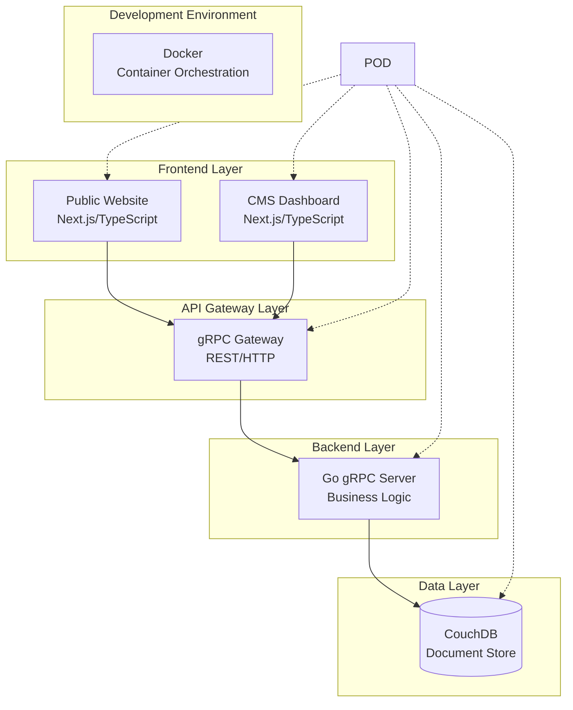

# Design Document

## Overview

The SaaS & Tech Startup platform is designed as a modern, scalable web application built on a microservices-inspired architecture within a monorepo. The system consists of three main components: a public-facing website, a content management system (CMS), and a unified backend API. All components are containerized using Docker for consistent development and deployment environments.

## Architecture

### High-Level Architecture



### Technology Stack

**Frontend:**
- Framework: Next.js 14+ with App Router
- Language: TypeScript with strict mode
- Styling: Tailwind CSS 3.x
- UI Components: shadcn/ui
- State Management: Zustand or React Query for server state
- Authentication: NextAuth.js

**Backend:**
- Language: Go 1.21+
- gRPC Framework: google.golang.org/grpc
- REST Gateway: grpc-gateway
- Authentication: JWT with middleware
- Validation: protoc-gen-validate
- Logging: structured logging with slog

**Database:**
- Primary: CouchDB 3.x
- Driver: go-couchdb or kivik
- Design Documents: Views and indexes for efficient querying

**Development:**
- Containerization: Docker with Compose
- Monorepo: Nx or Turborepo for build orchestration
- Package Management: pnpm (frontend), Go modules (backend)

## Components and Interfaces

### Frontend Components

#### Public Website (apps/website)
- **Pages**: Home, About, Services, Blog, Contact
- **Components**: Header, Footer, Hero sections, Feature cards
- **Layouts**: Responsive layouts with mobile-first design
- **SEO**: Next.js metadata API for optimal search engine optimization

#### CMS Dashboard (apps/cms)
- **Authentication**: Login/logout with role-based access
- **Content Editor**: Rich text editor with media upload
- **Page Management**: CRUD operations for website pages
- **Media Library**: File upload and management system
- **User Management**: Admin user creation and role assignment

#### Shared UI Library (packages/ui)
- **Components**: Reusable shadcn/ui components
- **Themes**: Consistent design tokens and color schemes
- **Icons**: Lucide React icon library
- **Forms**: React Hook Form with Zod validation

### Backend Components

#### gRPC Services (cmd/api)
```protobuf
// Content Service
service ContentService {
  rpc CreatePage(CreatePageRequest) returns (Page);
  rpc GetPage(GetPageRequest) returns (Page);
  rpc UpdatePage(UpdatePageRequest) returns (Page);
  rpc DeletePage(DeletePageRequest) returns (Empty);
  rpc ListPages(ListPagesRequest) returns (ListPagesResponse);
}

// Media Service  
service MediaService {
  rpc UploadFile(UploadFileRequest) returns (File);
  rpc GetFile(GetFileRequest) returns (File);
  rpc DeleteFile(DeleteFileRequest) returns (Empty);
}

// Auth Service
service AuthService {
  rpc Login(LoginRequest) returns (LoginResponse);
  rpc ValidateToken(ValidateTokenRequest) returns (User);
  rpc RefreshToken(RefreshTokenRequest) returns (LoginResponse);
}
```

#### Repository Layer (internal/repository)
- **CouchDB Client**: Connection management and query building
- **Document Models**: Go structs with JSON tags for CouchDB documents
- **CRUD Operations**: Generic repository pattern for data access
- **View Queries**: CouchDB view-based queries for complex data retrieval

## Data Models

### CouchDB Document Structure

#### Page Document
```json
{
  "_id": "page:home",
  "_rev": "1-abc123",
  "type": "page",
  "title": "Home Page",
  "slug": "home",
  "content": {
    "blocks": [
      {
        "type": "hero",
        "data": {
          "title": "Welcome to Our Platform",
          "subtitle": "Build amazing things",
          "image": "hero-bg.jpg"
        }
      }
    ]
  },
  "meta": {
    "title": "Home - SaaS Platform",
    "description": "Welcome to our platform"
  },
  "status": "published",
  "created_at": "2024-01-01T00:00:00Z",
  "updated_at": "2024-01-01T00:00:00Z"
}
```

#### User Document
```json
{
  "_id": "user:admin@example.com",
  "_rev": "1-def456",
  "type": "user",
  "email": "admin@example.com",
  "password_hash": "$2a$10$...",
  "role": "admin",
  "profile": {
    "name": "Admin User",
    "avatar": "avatar.jpg"
  },
  "created_at": "2024-01-01T00:00:00Z",
  "last_login": "2024-01-01T00:00:00Z"
}
```

#### Media Document
```json
{
  "_id": "media:image-123",
  "_rev": "1-ghi789",
  "type": "media",
  "filename": "hero-image.jpg",
  "original_name": "hero-image.jpg",
  "mime_type": "image/jpeg",
  "size": 1024000,
  "url": "/uploads/hero-image.jpg",
  "alt_text": "Hero background image",
  "uploaded_by": "user:admin@example.com",
  "created_at": "2024-01-01T00:00:00Z"
}
```

### CouchDB Views

#### Pages by Status
```javascript
// Design Document: _design/pages
{
  "views": {
    "by_status": {
      "map": "function(doc) { if(doc.type === 'page') { emit(doc.status, doc); } }"
    },
    "by_slug": {
      "map": "function(doc) { if(doc.type === 'page') { emit(doc.slug, doc); } }"
    }
  }
}
```

## Error Handling

### Frontend Error Handling
- **API Errors**: Centralized error handling with toast notifications
- **Form Validation**: Client-side validation with Zod schemas
- **Network Errors**: Retry logic with exponential backoff
- **404 Pages**: Custom error pages for missing content

### Backend Error Handling
- **gRPC Status Codes**: Proper status codes for different error types
- **Validation Errors**: Structured validation error responses
- **Database Errors**: CouchDB conflict resolution and retry logic
- **Authentication Errors**: JWT validation and refresh token handling

### Error Response Format
```json
{
  "error": {
    "code": "VALIDATION_ERROR",
    "message": "Invalid input data",
    "details": [
      {
        "field": "title",
        "message": "Title is required"
      }
    ]
  }
}
```

## Testing Strategy

### Frontend Testing
- **Unit Tests**: Jest and React Testing Library for components
- **Integration Tests**: Playwright for end-to-end testing
- **Visual Testing**: Storybook for component documentation
- **Type Safety**: TypeScript strict mode with comprehensive types

### Backend Testing
- **Unit Tests**: Go testing package with testify assertions
- **Integration Tests**: Test containers for CouchDB integration
- **gRPC Testing**: gRPC test client for service testing
- **Load Testing**: Basic performance testing with Go benchmarks

### Database Testing
- **Test Database**: Separate CouchDB instance for testing
- **Data Fixtures**: Consistent test data setup and teardown
- **View Testing**: Validation of CouchDB view functions

## Security Considerations

### Authentication & Authorization
- **JWT Tokens**: Short-lived access tokens with refresh tokens
- **Role-Based Access**: Admin and editor roles with different permissions
- **Password Security**: bcrypt hashing with appropriate cost factor
- **Session Management**: Secure cookie handling in Next.js

### Data Security
- **Input Validation**: Server-side validation for all inputs
- **SQL Injection Prevention**: Parameterized queries (CouchDB is NoSQL but still applies)
- **XSS Prevention**: Content sanitization and CSP headers
- **CORS Configuration**: Proper CORS setup for API access

### Infrastructure Security
- **Container Security**: Non-root containers with minimal base images
- **Network Security**: Container network isolation
- **Secrets Management**: Environment variables for sensitive data
- **HTTPS**: TLS termination at reverse proxy level

## Performance Optimization

### Frontend Performance
- **Code Splitting**: Next.js automatic code splitting
- **Image Optimization**: Next.js Image component with WebP support
- **Caching**: Static generation and ISR for content pages
- **Bundle Analysis**: Regular bundle size monitoring

### Backend Performance
- **Connection Pooling**: CouchDB connection management
- **Caching**: In-memory caching for frequently accessed data
- **Compression**: gRPC compression for large responses
- **Monitoring**: Structured logging and metrics collection

### Database Performance
- **Indexing**: Proper CouchDB views and indexes
- **Query Optimization**: Efficient view queries and reduce functions
- **Replication**: Read replicas for scaling if needed
- **Compaction**: Regular database compaction scheduling